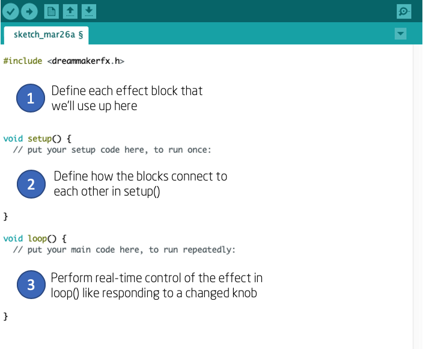

# The Anatomy of an Effect
------

Let's start by learning the anatomy of a basic Arduino "Sketch" (aka "program" in Arduino speak).

With the Arduino app open, go to File->New.  You'll see a new text editor window appear with a new "sketch".  This sketch will come pre-populated with two *functions*. One is called `setup()` and another is called `loop()`.  

When the sketch is downloaded to our hardware, it will first run any commands in the `setup()` function once.  And then it will run the `loop()` function repeatidly.  Each time you power up the board, it goes through the same sequence (run `setup()` once and then run `loop()` indefinitely).

When creating effects, there are three places we'll add code.

First (in area #1), we'll define / "declare" which effects building blocks we'll be using at the very top of the file.  We can declare up to 100 effect blocks (for example, if you wanted to create 100 delay lines and wire them together, go for it!).  

Next (in area #2), we'll define how these building blocks connect to the audio in / out jacks and to each other.  We can also route control signals between the effect blocks here too.

Finally (in area #3), we'll add any real-time controls of the effect parameters.  This is where we, for example, respond to a pressed footswtich, changed knob or switch.

While some effects may look complex at first glace, they all really have these three components.

