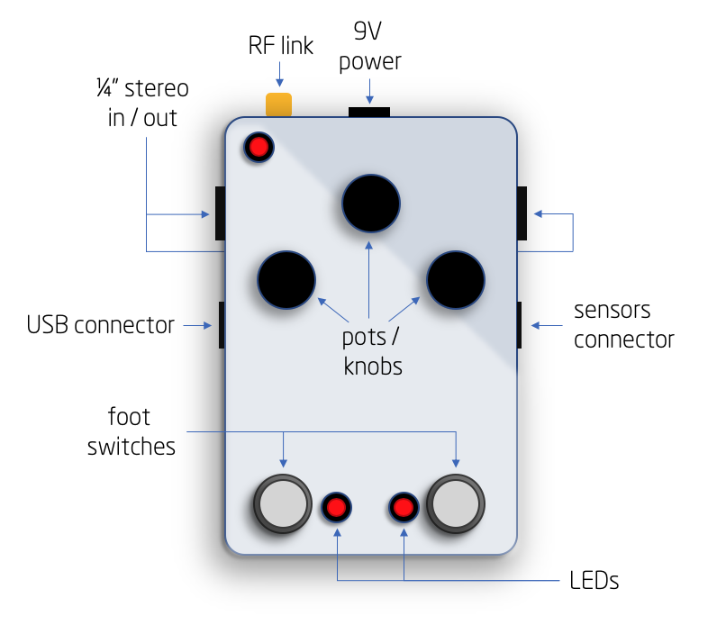
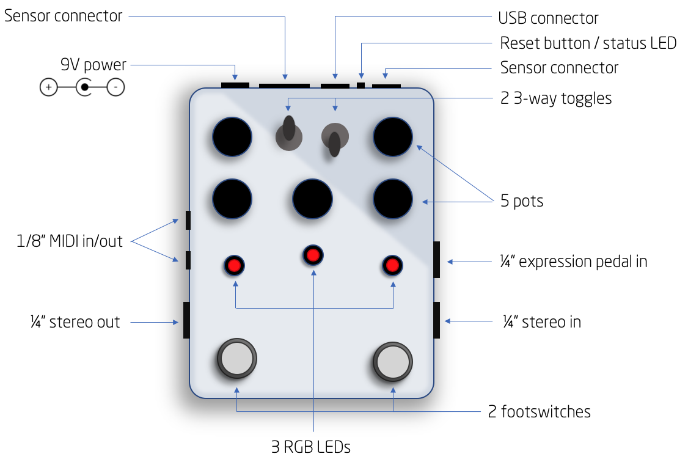

 .. _hardware:

*****************
Meet the Hardware
*****************

Gen 1: The Dream Lemur
######################

The first generation hardware was designed in the spring of 2019 and manufactured during the summer.

Features:
 * 450MHz SHARC DSP + SAMD51 processor (running Arduino stuff)
 * Stereo in / Stereo out @ 48kHz sampling rate
 * Short (QWIIC) and long range (CAT-5) sensor interfaces
 * Wireless sensor interface (via RF transceiver)
 * USB connector (for programming and debug)
 * 3 pots
 * 2 footswitches
 * 2 red LEDs

Gen 2: The Beyonder
###################

The design for the second generation hardware began as soon as we started using the first generation and realized all the things that could be improved.  Our first gen-2 hardware is in house and working great so far.

Features
 * 450MHz SHARC DSP + SAMD51 processor (running Arduino stuff)
 * Stereo in / Stereo out @ 48kHz sampling rate
 * Expression pedal 
 * MIDI in / out
 * Short (QWIIC) and long range (CAT-5) sensor interfaces
 * USB connector (for programming and debug)
 * 5 pots
 * 2 footswitches
 * 3 RGB LEDs
 * 2 3-way toggles

